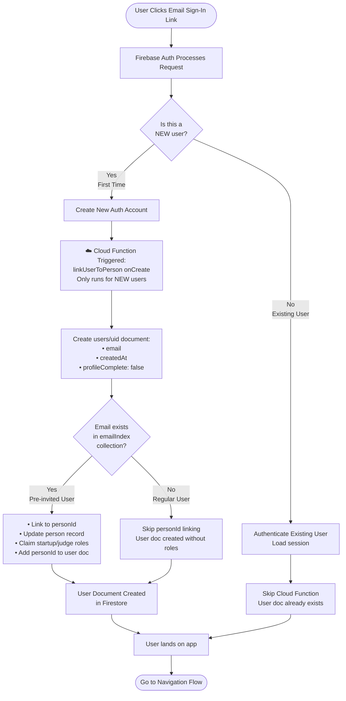

# User Authentication Flow

```mermaid
flowchart TD
    Start([User Clicks Email Sign-In Link]) --> FirebaseAuth[Firebase Auth Processes Request]

    FirebaseAuth --> IsNewUser{Is this a<br/>NEW user?}

    IsNewUser -->|No<br/>Existing User| ExistingAuth[Authenticate Existing User<br/>Load session]

    IsNewUser -->|Yes<br/>First Time| CreateAuth[Create New Auth Account]

    ExistingAuth --> SkipFunction[Skip Cloud Function<br/>User doc already exists]

    CreateAuth --> CloudFunction["☁️ Cloud Function Triggered:<br/>linkUserToPerson onCreate<br/>Only runs for NEW users"]

    CloudFunction --> CreateUserDoc["Create users/uid document:<br/>• email<br/>• createdAt<br/>• profileComplete: false"]

    CreateUserDoc --> CheckEmailIndex{Email exists<br/>in emailIndex<br/>collection?}

    CheckEmailIndex -->|Yes<br/>Pre-invited User| LinkPerson["• Link to personId<br/>• Update person record<br/>• Claim startup/judge roles<br/>• Add personId to user doc"]

    CheckEmailIndex -->|No<br/>Regular User| SkipLink[Skip personId linking<br/>User doc created without roles]

    LinkPerson --> Complete[User Document Created<br/>in Firestore]
    SkipLink --> Complete

    Complete --> LandOnApp[User lands on app]
    SkipFunction --> LandOnApp

    LandOnApp --> End([Go to Navigation Flow])
```
